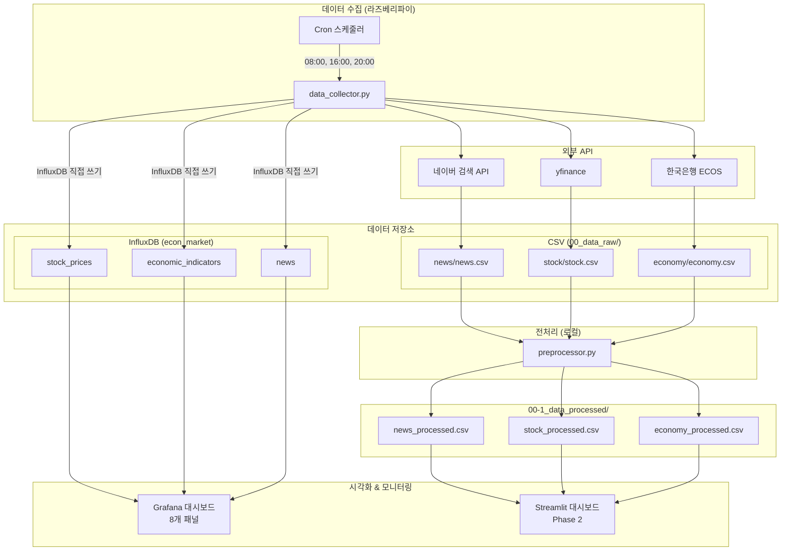
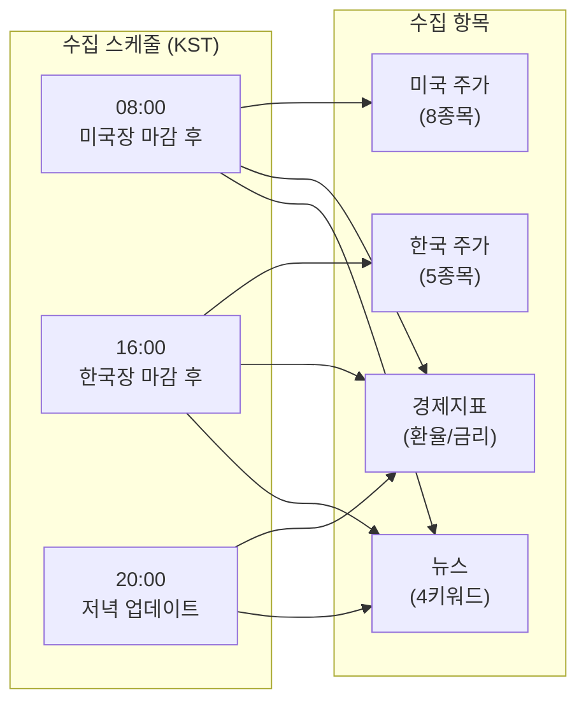
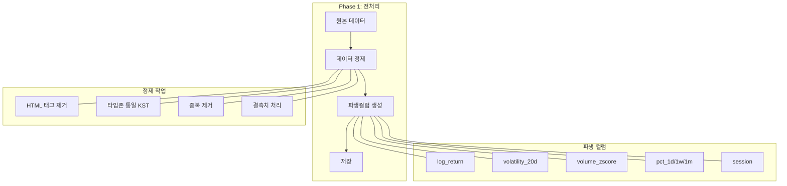
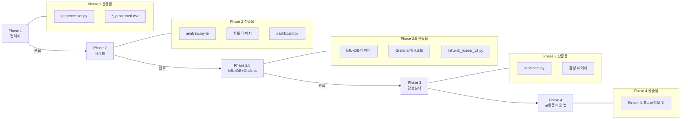
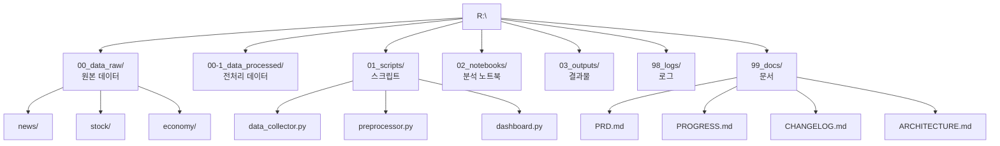
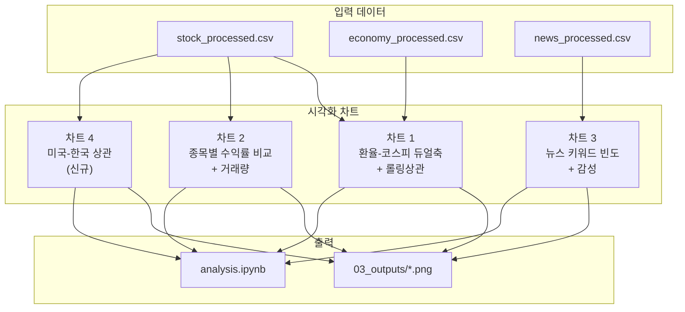
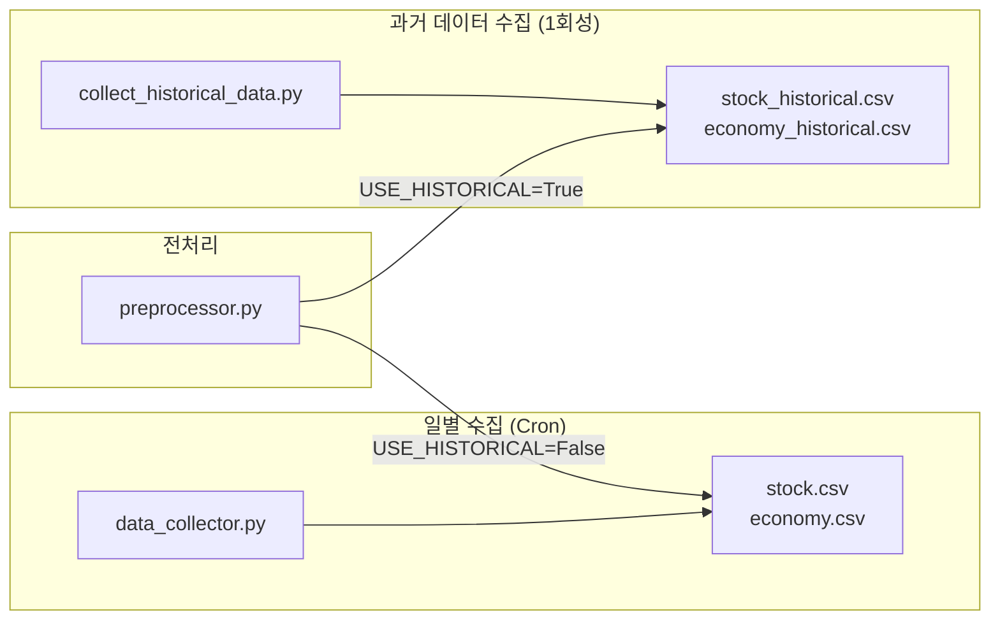
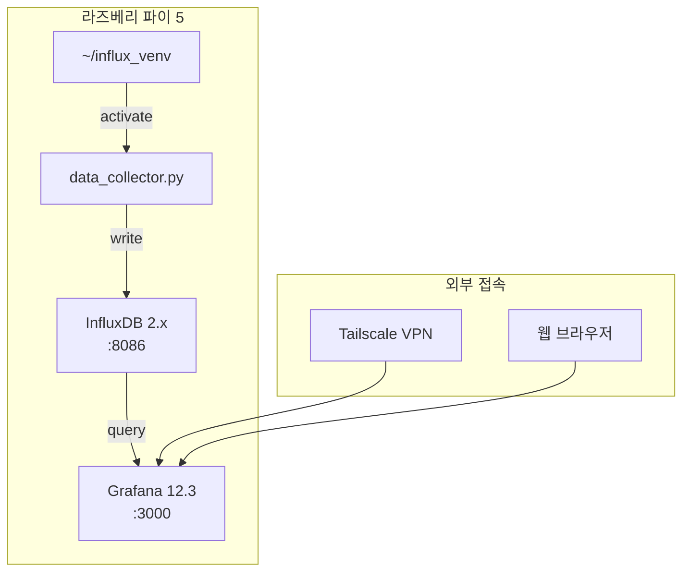
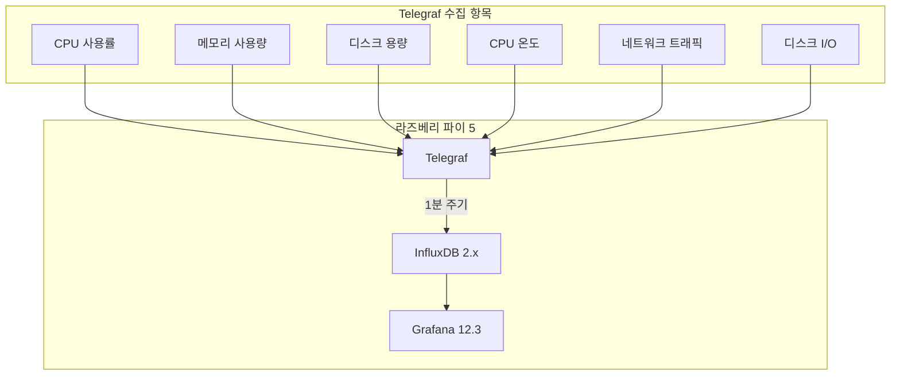

# 시스템 아키텍처

> 투자 데이터 분석 시스템 구조 및 흐름
>
> **최종 업데이트**: 2025-12-07 (Telegraf 시스템 모니터링 추가)

---

## 1. 전체 시스템 구조



---

## 2. 데이터 수집 흐름



---

## 3. 데이터 처리 파이프라인



---

## 4. 수집 종목 구조 (27개)

### 한국 지수/ETF (3개)
| 종목 | 티커 |
|------|------|
| 코스피 | ^KS11 |
| 코스닥 | ^KQ11 |
| KODEX200 | 069500.KS |

### 한국 개별종목 (16개)
| 섹터 | 종목 | 용도 태그 |
|------|------|-----------|
| 반도체 | 삼성전자, SK하이닉스 | 수출, 경기민감, 기술 |
| 2차전지 | LG에너지솔루션 | 수출, 성장, 친환경 |
| 바이오 | 삼성바이오로직스 | 성장, 헬스케어, 방어 |
| 자동차 | 현대차 | 수출, 경기민감, 제조 |
| 금융 | KB금융 | 금리민감, 배당, 내수 |
| 철강 | POSCO홀딩스 | 경기민감, 수출, 소재 |
| IT/플랫폼 | NAVER, 카카오 | 성장, 내수, 기술/IP |
| 엔터 | HYBE, SM, JYP | 문화, 성장, K-콘텐츠 |
| 게임 | 크래프톤, 엔씨소프트 | 문화, 기술, IP |
| 콘텐츠 | CJ ENM, CGV | 문화, 내수, 미디어 |

### 미국 (8개)
| 구분 | 종목 |
|------|------|
| 지수 | S&P500, 나스닥, VIX |
| ETF | QQQ, SPY, DIA, TLT, GLD |

### 용도 태그 체계
| 태그 | 분석 활용 |
|------|-----------|
| 경기민감 | 경기선행지표 상관분석 |
| 금리민감 | 기준금리 상관분석 |
| 수출 | 환율 상관분석 |
| 내수 | 소비심리 상관분석 |
| 문화 | K-콘텐츠 섹터 분석 |

### 경제지표/뉴스
- 경제지표: 환율(USD/JPY/EUR), 기준금리
- 뉴스 키워드: 경제, 부동산, 반도체, 코스피

---

## 5. Phase별 진행 흐름



---

## 6. 폴더 구조



---

## 7. 시각화 계획 (Phase 2)



---

## 8. 데이터 수집 기준

### 시간 기준
| 항목 | 기준 |
|------|------|
| 타임존 | Asia/Seoul (KST) |
| 한국 장마감 | 15:30 KST |
| 미국 장마감 | 06:00 KST (동부 16:00) |
| 수집 주기 | 1일 3회 (08:00, 16:00, 20:00) |

### 데이터 품질 기준
| 항목 | 처리 방법 |
|------|-----------|
| 주말/공휴일 | forward-fill + is_holiday_gap 플래그 |
| 중복 데이터 | 일자별 마지막 레코드 유지 |
| 뉴스 중복 | 제목 유사도 > 0.8 + 1시간 이내 |
| 결측치 | NaN 유지 (로그 기록) |

### 파생 컬럼 계산
| 컬럼 | 계산식 | 용도 |
|------|--------|------|
| log_return | ln(close/close[-1]) | 수익률 분석 |
| volatility_20d | std(log_return, 20) × √252 | 변동성 |
| volume_zscore | (vol - ma20) / std20 | 이상치 탐지 |
| pct_1d/1w/1m | (v - v[-n]) / v[-n] × 100 | 변동률 |

---

## 9. Historical 데이터 구조

### 데이터 파일 구성
```
00_data_raw/
├── stock/
│   ├── stock.csv              # 일별 수집 (최근)
│   └── stock_historical.csv   # 5년치 (2020~현재)
└── economy/
    ├── economy.csv            # 일별 수집 (최근)
    └── economy_historical.csv # 5년치 (2020~현재)
```

### Historical 데이터 스키마

#### stock_historical.csv
| 컬럼 | 타입 | 설명 |
|------|------|------|
| date | datetime | 거래일 |
| name | string | 종목명 (코스피, 삼성전자 등) |
| ticker | string | 티커 (^KS11, 005930.KS 등) |
| open | float | 시가 |
| high | float | 고가 |
| low | float | 저가 |
| close | float | 종가 |
| volume | int | 거래량 |

#### economy_historical.csv
| 컬럼 | 타입 | 설명 |
|------|------|------|
| date | string | 날짜 (YYYYMMDD 또는 YYYYMM) |
| indicator | string | 지표명 |
| value | float | 값 |
| period | string | D(일별) / M(월별) |

### 수집 스크립트



### 데이터 소스 선택
```python
# preprocessor.py
USE_HISTORICAL = True   # 5년치 데이터 (기본값)
USE_HISTORICAL = False  # 최근 수집 데이터
```

---

## 10. InfluxDB + Grafana 아키텍처 (Phase 2.5)

### 시스템 구성



### InfluxDB 데이터 모델

| Measurement | Tags | Fields | 설명 |
|-------------|------|--------|------|
| `stock_prices` | name, ticker | open, high, low, close, volume | 27개 종목 주가 |
| `economic_indicators` | indicator, period | value | 환율, 금리 등 |
| `news` | keyword | title, description, link, count | 뉴스 수집 건수 |

### 데이터 현황 (2025-12-03 기준)

| Measurement | 레코드 수 | 기간 |
|-------------|----------|------|
| stock_prices | 38,319건 | 2020-01-02 ~ 현재 |
| economic_indicators | 4,447건 | 2020-01-01 ~ 현재 |
| news | 실시간 | 수집 시점 ~ |

### Grafana 대시보드 패널 (8개)

| 패널 | 내용 | Flux 필터 |
|------|------|-----------|
| 한국 지수 | 코스피, 코스닥 | `r.name == "코스피" or r.name == "코스닥"` |
| 한국 ETF | KODEX200 | `r.name == "KODEX200"` |
| 한국 대형주 | 삼성전자, SK하이닉스 등 7개 | `r.name == "삼성전자" or ...` |
| IT/플랫폼 | NAVER, 카카오 | `r.name == "NAVER" or r.name == "카카오"` |
| 엔터/게임 | HYBE, SM, JYP 등 7개 | `r.name == "HYBE" or ...` |
| 미국 지수/ETF | S&P500, 나스닥, VIX 등 8개 | `r.name == "S&P500" or ...` |
| 환율/금리 | 모든 경제지표 | `r._measurement == "economic_indicators"` |
| 뉴스 건수 | 키워드별 수집 건수 | `r._measurement == "news"` |

### 스크립트 구성

| 스크립트 | 용도 | 실행 환경 |
|----------|------|----------|
| `01_data_collector.py` | 일간 수집 (CSV + InfluxDB + Telegram) | Cron + influx_venv |
| `04_influxdb_backfill_15years.py` | 15년 데이터 백필 (1회성) | influx_venv |
| `05_create_grafana_dashboard_v2.py` | 대시보드 자동 생성 | influx_venv |
| `07_create_system_health_dashboard.py` | 시스템 헬스 대시보드 | influx_venv |
| `collection_logger.py` | 수집 로그 InfluxDB 저장 | 모듈 |
| `notifier.py` | Telegram 알림 모듈 | 모듈 |

### 접속 정보

| 서비스 | URL | 비고 |
|--------|-----|------|
| InfluxDB UI | `http://<IP>:8086` | org: my-org, bucket: econ_market |
| Grafana | `http://<IP>:3000` | admin 계정 |
| 실제 데이터 대시보드 | `http://<IP>:3000/d/61949380-...` | 18개 패널 |
| 정규화 데이터 대시보드 | `http://<IP>:3000/d/021d427b-...` | 18개 패널 |
| 수집 로그 대시보드 | `http://<IP>:3000/d/94ce2c05-...` | 13개 패널 |
| 시스템 헬스 대시보드 | `http://<IP>:3000/d/system-health-raspi5` | 12개 패널 |

---

## 11. Telegraf 시스템 모니터링 (Phase 2.7)

### 시스템 구성



### Telegraf 설정

| 설정 | 값 |
|------|-----|
| 수집 주기 | 60초 |
| 설정 파일 | `/etc/telegraf/telegraf.d/raspi.conf` |
| 출력 버킷 | `econ_market` |
| 호스트명 | `raspi5` |

### 수집 Measurement

| Measurement | Fields | 설명 |
|-------------|--------|------|
| `cpu` | usage_idle, usage_user, usage_system | CPU 사용률 |
| `mem` | used, available, used_percent | 메모리 |
| `disk` | free, used, used_percent | 디스크 (/, /raspi/WD4T) |
| `cpu_temp` | value | CPU 온도 (밀리섭씨) |
| `net` | bytes_recv, bytes_sent | 네트워크 (eth0, tailscale0) |
| `diskio` | read_bytes, write_bytes | 디스크 I/O (mmcblk0) |
| `system` | uptime | 시스템 가동 시간 |

### 시스템 헬스 대시보드 (12개 패널)

**1행: 요약 게이지 (6개)**
- CPU 사용률 (Gauge)
- 메모리 사용률 (Gauge)
- 디스크 사용률 rootfs (Gauge)
- CPU 온도 (Gauge)
- 시스템 업타임 (Stat)
- 디스크 여유 WD4T (Stat)

**2행: 시계열 차트 (3개)**
- CPU 사용률 추이
- 메모리 사용량 추이
- CPU 온도 추이

**3행: 네트워크/I/O (3개)**
- 네트워크 트래픽
- 디스크 I/O

### 임계값 설정

| 항목 | 정상 | 경고 | 위험 |
|------|------|------|------|
| CPU 사용률 | < 50% | 50-70% | > 90% |
| 메모리 사용률 | < 60% | 60-80% | > 90% |
| 디스크 사용률 | < 60% | 60-80% | > 90% |
| CPU 온도 | < 50°C | 50-65°C | > 80°C |
